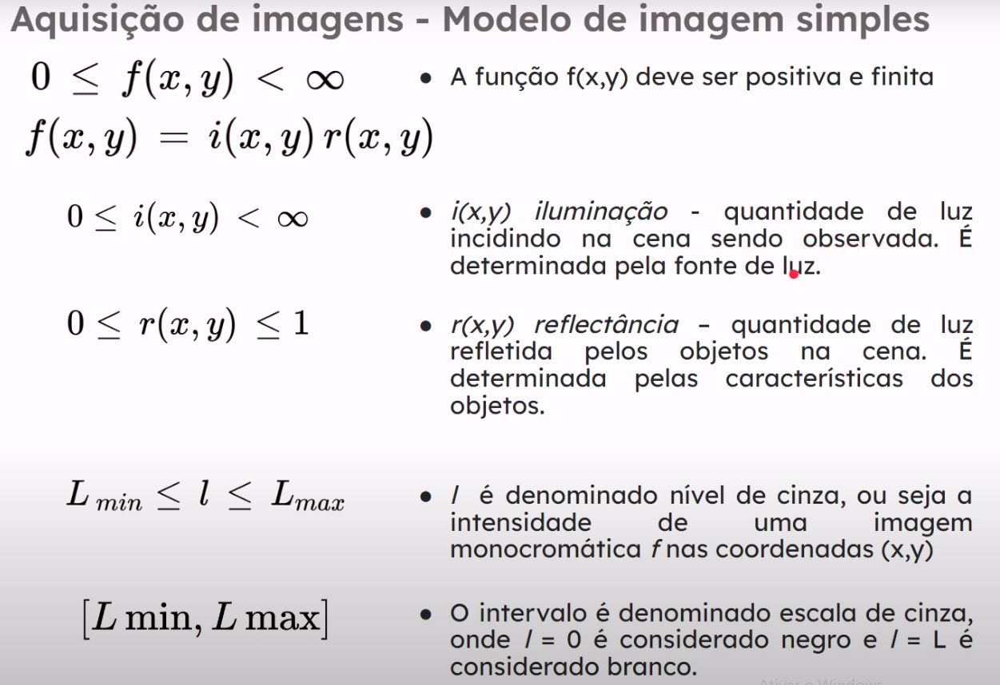
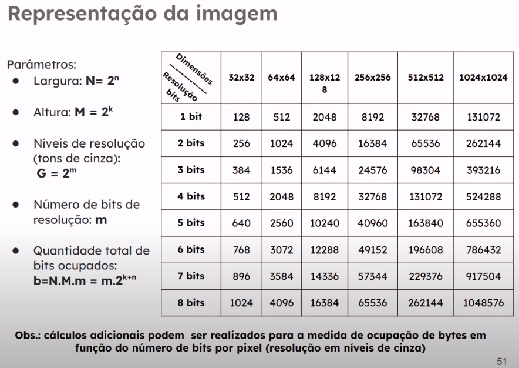

# Aula 1-1
O que é fotografia e introdução histórica sobre fotografia.
Entendimento sobre o que é cor e percepções básicas de cores.

## Tipos de imagens

### Imagens digitais
Caputaradas por um sensor e convertida em um conjunto de pixels, contendo informações de cor ou intensidade.

### Imagens analógicas
Capturada em filme fotográfico por meio de processos químicos.

### Imagens
Associadas a caputra de uma cena em um único quadro

### Vídeos:
Uma sequência por um determinado período de tempo de imagens, criando ilusão do movimento. (Em geral 30fps)

## Camerâs e fotografia perspectiva histórica
Na aula foi falado sobre a história da evolução das câmeras e da fotografia.

## Radiação Eletromagnética
Imagens e suas aplicações podem ser categorizadas de acordo com sua fonte.

Visão computacional pode trabalhar com outros espectros fora do visível.

## Percepção visual de imagens

Cores frias: Associados a cores como azul, violeta e verde.
Cores quentes: Vermelho, laranja e amarelo.
Cores neutras: Acinzentados, marrons e pastéis.

Cores percebidas são relacionadas as luz refletidas.
Luz acromática ou monocromática: luz sem cor.
Fonte de luz pode ser radiância, luminancia e brilho.

## Fotografia
Segundo Michaelis online
"Arte ou processo de reproduzir pela ação da luz ou de qualquer espécia de energia radiante, sobre uma superficie sensibilizada, imagens obtidas mediante uma cêmara escura."

Segundo Websters
"A arte ou processo de produzir imagens pela ação de energia radiante e, especialmente, luz em uma superficie sensível, como filme ou em um sensor óptico"

## Propriedades das cores

Matiz: Cor visível

Saturação: A pureza em termos de mistura de branco

Brilho: Especifica o componente acromático, que é a quantidade de luz emitida ou refletida

## Percepção visual

Conceito de brilho está ligado a percepção visual da quantidade de luz proveniente de uma fonte luminosa.

- O brilho é um elemento crucial ao apresentar resultados que envolvem imagens digitais. (Para o ser humano)

- A sensibilidade do sistema visual humano ao brilho é representada de maneira logarítmica em relação a intensidade de luz que atinge o olho. (Resultados experimentais)

Efeito mach: O olho tende a subestimar ou superestimar a intensidade próxima as transições entre regiões de intensidades diferentes.

## Definição de imagem digital

Descrita por uma função f(x,y)
x,y -> cordenadas de posição
f() -> Intensidade relacionada

## Aquisição de imagens - CCD e CMOS

Sensores utilizados para obter imagens.

CCD consome menor energia
CMOS fotos mais nitidas e menos ruidosas
SCMOS (Tráz o melhor do CCD e do CMOS)

### Modelo de imagem simples

L_{min} e L_{max} dependem do sensor.

### Amostragem e quantificação

Vai ser quantizado o sinal para uma transformação do sinal de analógico para digital.

É obtido uma amostragem desse sinal.

### Representação da imagem

São representadas em um plano cartesiano bi-dimensional, em que cada ponto possui o valor da intensidade do pixel.

- Saturação: É o valor máximo no qual todos os valores de intensidade são cortados em uma certa região da imagem.
A região saturada tem um nível de intensidade alto e constante.

- Ruído visível: Padrão de textura granulada na imagem.

- Faixa dinâmica: Razão entre intensidade máxima mensuável e o nível mínimo detectável de intensidade no sistema.
Regra geral, o limite superior é determinado pela saturação e o inferior pelo ruído.

### Memória ocupada para representar a imagem

### Efeito do undersampling sobre solução da imagem!

[Efeito de undersampling sobre imagem](efeito_de_undersampling_sobre_imagem.png)

